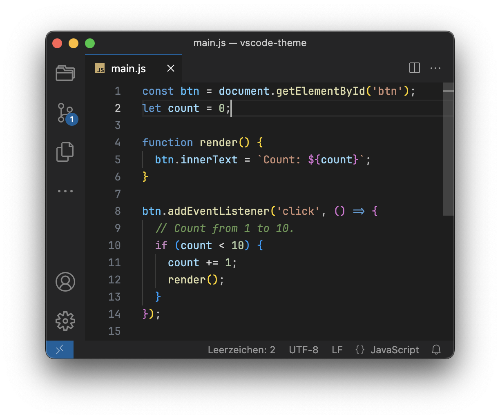

# VSCode Theme Dark Minimalist



A variant of the VSCode standard theme Dark+ with fewer distractions from the code area.

Minimalist means fewer borders, fewer color and background variants but also a little more, comments and function parameters now use an italic font variant.

## Optional Configuration

### Font Settings

Recommended values ​​for settings.json

```json
"editor.fontFamily": "'JetBrains Mono', monospace",
"editor.fontLigatures": true,
"editor.lineHeight": 21,
"editor.fontSize": 13,
"editor.tabSize": 2,
"terminal.integrated.fontFamily": "'JetBrains Mono', monospace","terminal.integrated.fontSize": 13,
"terminal.integrated.lineHeight": 1.25,
```
Font informations and download of [JetBrains Mono](https://www.jetbrains.com/lp/mono/)

### Markdown Gitup Preview Extention

Edit settings.json to blend the background for dark and dark dimmed theme

```json
"markdown.styles": [
    "https://cdn.jsdelivr.net/gh/m7r/vscode-theme-dark-minimalist@preview-github/markdown.css"
],
```